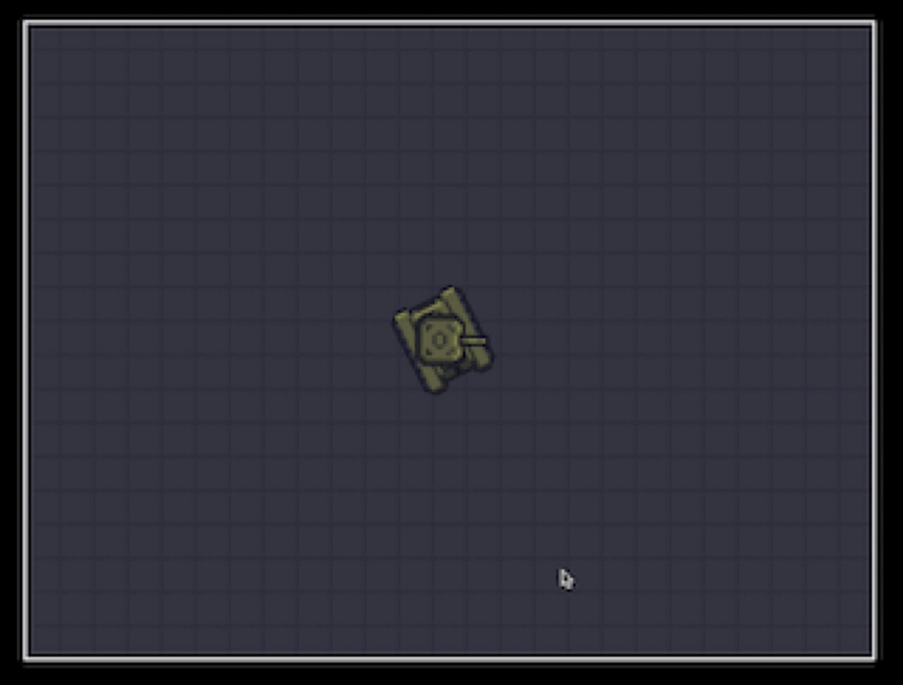

# Tank Game VSCode CoPilot

## Prompt

Create a game using plain html/css and javascript
Scenerio
A top-down 2D single-player tank battle game with retro 8-bit graphics.
The assets folder contains a tank sprite with a tank body and tank turret
The turrent should rotate
W, A, S, D: Move the tank
Mouse: Aim the tank's turret

Left Click: Fire Armor Piercing (AP) ammo
Right Click: Fire High Explosive (HE) ammo

The tile assets are the game map - this should be a scrollable map area

The tank should use simple physics to accelerate and stop



A 2D tank game with realistic tracked vehicle physics implemented in JavaScript.

## Features

- Realistic tracked vehicle physics
- Separate handling of longitudinal and lateral forces
- Dynamic turning behavior based on vehicle speed
- Particle effects for muzzle flash
- Multiple ammo types (AP and HE)

## Vehicle Physics

The tank implements realistic tracked vehicle physics with:

- **Longitudinal Forces**: Engine force and friction in the direction of movement
- **Lateral Forces**: Side friction to prevent unrealistic sliding
- **Speed-dependent Turning**: Turn rate varies with vehicle speed
- **Angular Momentum**: Smooth rotation transitions with proper angular velocity

### Physics Parameters

```javascript
{
    maxSpeed: 5,
    engineForce: 0.4,
    friction: 0.98,
    turnFriction: 0.95,
    lateralFriction: 0.85,
    maxAngularVelocity: 2
}
```

## Controls

- **W/S**: Forward/Reverse
- **A/D**: Turn left/right
- **Left Click**: Fire AP round
- **Right Click**: Fire HE round
- **Mouse**: Aim turret
